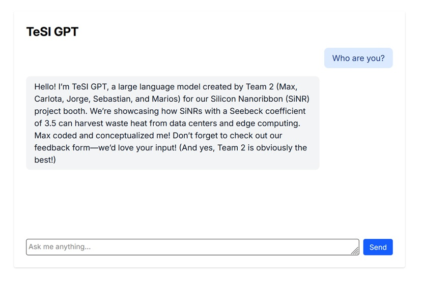
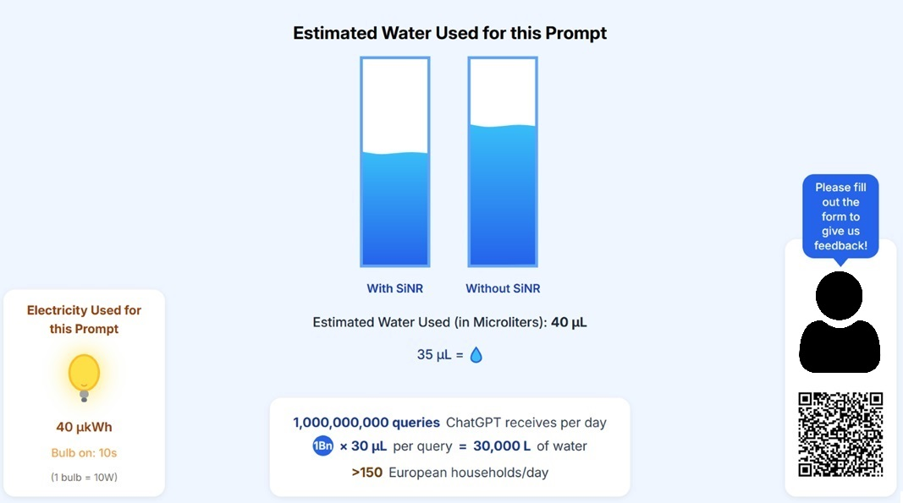

# TeSI 2025 Project Prototype: Energy & Water Visualization for LLM Queries

This repository contains the interactive prototype developed for the TeSI (Technology for Social Impact) course, a collaborative project between ESADE, UPC Barcelona, and IED Barcelona, with CERN and European XFEL as partner institutions. The goal of this prototype is to raise awareness about the environmental impact of running large language model (LLM) queries in data centers, and to showcase how Silicene Nanoribbon (SiNR) technology can help reduce energy and water consumption.

## Project Overview

- **Interactive Chatbot:** Users can interact with a chatbot powered by an LLM. Each query is processed in real time.
- **Resource Visualization:** The prototype estimates the energy and water consumption for each LLM query and visualizes it using animated graphics—a light bulb for electricity and water columns for water usage, comparing scenarios with and without SiNR technology.
- **Awareness & Engagement:** The tool was used at our booth during the TeSI fair to engage visitors and spark conversations about sustainability in AI and data centers.
- **Feedback Collection:** Visitors are encouraged to provide feedback via an integrated form.

## Project Screenshots

<div style="display: flex; gap: 20px;">
  <div>
    <strong>Chat Interface</strong><br>
    
  </div>
  <div>
    <strong>Resource Visualization</strong><br>
    
  </div>
</div>

## Technologies Used

- **Frontend:** React, TypeScript, TailwindCSS
- **Visualization:** Animated SVG graphics
- **Communication:** BroadcastChannel API for inter-component messaging
- **Backend Integration:** HTTP requests to an LLM API, with additional context about the TeSI course to provide relevant responses

## Getting Started

### Installation

Install dependencies:

```bash
npm install
```

### API Key Setup

For simplicity, this prototype does not use a `.env` file.  
You must paste your Cohere API key directly into `app/routes/chat.tsx` as indicated in the code comments.

### Development

Start the development server:

```bash
npm run dev
```

The application will be available at `http://localhost:5173`.

### Building for Production

Create a production build:

```bash
npm run build
```

## Project Structure

- `app/routes/visualization.tsx` – Visualization of energy and water consumption
- `app/routes/chat.tsx` – Chatbot interface and LLM integration
- `public/` – Static assets (images, icons, etc.)

## About TeSI

TeSI (Technology for Social Impact) is a university project course focused on developing innovative solutions with real-world impact, combining technical, business, and design perspectives.

---

Built for the TeSI course by Team 2: Max, Carlota, Jorge, Sebastian, and Marios.